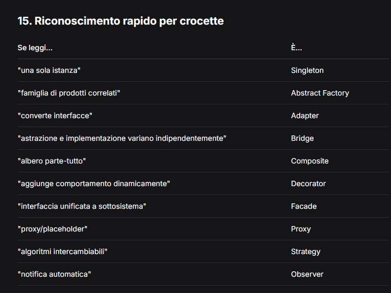

# Design Patterns — Riepilogo per Esame (Singleton, Strategy, Observer)

Questo file contiene teoria, esempi e diagrammi UML ASCII per i 3 pattern principali richiesti all'esame.  
Utile per domande a crocette, riconoscimento pattern ed esercizi di disegno UML.

---

## Indice
1. Singleton
2. Strategy
3. Observer
4. Tabella riassuntiva
5. Consigli per l'esame

---

## 1. Singleton

### Obiettivo
Garantire che una classe abbia **una sola istanza** e fornire un **punto di accesso globale** a tale istanza.

### Quando usarlo
- Logger
- Connessione a database
- Printer spooler
- Window manager
- Gestore di configurazione

### Struttura chiave
- Costruttore **privato** (`-`)
- Attributo **statico e privato** che tiene l'unica istanza
- Metodo **statico e pubblico** `getInstance()`

### Diagramma UML (ASCII)

┌─────────────────┐
│ Singleton │
├─────────────────┤
│ - instance │
│ : Singleton │
├─────────────────┤
│ - Singleton() │
│ + getInstance() │
│ : Singleton │
└─────────────────┘

### Esempio mentale (Java)
```java
public class Singleton {
    private static Singleton instance;
    private Singleton() {}
    public static Singleton getInstance() {
        if (instance == null) instance = new Singleton();
        return instance;
    }
}
Attenzione in esame
❌ Non confondere con variabile globale

✅ Il costruttore deve essere privato

✅ getInstance() è statico

2. Strategy
Obiettivo
Definire una famiglia di algoritmi intercambiabili, incapsularli e renderli intercambiabili a runtime.

Quando usarlo
Navigatore (macchina/treno/bici)

Pagamenti (carta/PayPal/crypto)

Notifiche (email/SMS/push)

Struttura chiave
Context → ha un riferimento a Strategy

Strategy → interfaccia con un metodo (es. esegui())

ConcreteStrategy → implementano Strategy

Diagramma UML (ASCII)
┌─────────────┐          ┌─────────────────────┐
│  Context    │          │   <<interface>>     │
├─────────────┤          │   Strategy          │
│ - strategy  │─────────►├─────────────────────┤
├─────────────┤          │ + esegui()          │
│ + setStrategy()        └─────────────────────┘
│ + esegui()                     △
└─────────────┘                   │
                                  │
              ┌───────────────────┼───────────────────┐
              │                   │                   │
              ▼                   ▼                   ▼
      ┌──────────────┐    ┌──────────────┐    ┌──────────────┐
      │ ConcreteS1   │    │ ConcreteS2   │    │ ConcreteS3   │
      ├──────────────┤    ├──────────────┤    ├──────────────┤
      │ + esegui()   │    │ + esegui()   │    │ + esegui()   │
      └──────────────┘    └──────────────┘    └──────────────┘
Esempio mentale (Java)
java
interface StrategiaPagamento {
    void paga(int importo);
}

class Carta implements StrategiaPagamento { 
    public void paga(int importo) { /* paga con carta */ }
}

class PayPal implements StrategiaPagamento { 
    public void paga(int importo) { /* paga con PayPal */ }
}

class Carrello {
    private StrategiaPagamento strategia;
    public void setStrategia(StrategiaPagamento s) { this.strategia = s; }
    public void paga(int importo) { strategia.paga(importo); }
}

Attenzione in esame
❌ "Notifica" NON è Strategy (è Observer)

✅ Le ConcreteStrategy implementano l'interfaccia

3. Observer
Obiettivo
Definire una dipendenza uno-a-molti tra oggetti: quando un oggetto cambia stato, tutti i dipendenti vengono notificati automaticamente.

Quando usarlo
GUI (pulsante che notifica finestre)

Spreadsheet (grafico che si aggiorna quando cambiano i dati)

Struttura chiave
Subject → tiene lista di Observer, metodi attach(), detach(), notify()

Observer → interfaccia con update()

ConcreteObserver → implementa update() e si registra al Subject

Diagramma UML (ASCII)
text
┌─────────────┐          ┌─────────────────────┐
│  Subject    │          │   <<interface>>     │
├─────────────┤          │   Observer          │
│ - observers │─────────►├─────────────────────┤
├─────────────┤          │ + update()          │
│ + attach()  │          └─────────────────────┘
│ + detach()  │                    △
│ + notify()  │                    │
└─────────────┘                    │
                                   │
              ┌────────────────────┼────────────────────┐
              │                    │                    │
              ▼                    ▼                    ▼
      ┌──────────────┐     ┌──────────────┐     ┌──────────────┐
      │ ConcreteObs1 │     │ ConcreteObs2 │     │ ConcreteObs3 │
      ├──────────────┤     ├──────────────┤     ├──────────────┤
      │ + update()   │     │ + update()   │     │ + update()   │
      └──────────────┘     └──────────────┘     └──────────────┘
Esempio mentale (Java)
java
interface Observer {
    void update(String messaggio);
}

class Subject {
    private List<Observer> observers = new ArrayList<>();
    public void attach(Observer o) { observers.add(o); }
    public void detach(Observer o) { observers.remove(o); }
    public void notify(String msg) {
        for (Observer o : observers) o.update(msg);
    }
}

class ConcreteObserver implements Observer {
    private String nome;
    public ConcreteObserver(String nome) { this.nome = nome; }
    public void update(String msg) { 
        System.out.println(nome + " ha ricevuto: " + msg); 
    }
}
Attenzione in esame
✅ Parole chiave: notifica, aggiornamento automatico, subscribe

✅ Observer non sa chi lo notifica (low coupling)

4. Tabella riassuntiva (da memorizzare)
Singleton	una sola istanza	costruttore privato + metodo statico	getInstance()
Strategy	algoritmi intercambiabili	Context → Strategy (interfaccia)	implementa, runtime
Observer	notifica automatica	Subject → Observer (interfaccia)	attach, notify, update

5. Consigli per l'esame
Domande a crocette
Se leggo "un'istanza" → Singleton

Se leggo "algoritmi intercambiabili" → Strategy

Se leggo "notifica automatica a più oggetti" → Observer

Esercizi di disegno UML
Singleton: una sola casella, costruttore -, attributo statico -, metodo statico +
Strategy: tre elementi: Context → interfaccia ← ConcreteStrategies
Observer: Subject con lista, freccia verso interfaccia Observer, ConcreteObserver con update()

Errori comuni da evitare
❌ Mettere costruttore public in Singleton

❌ Chiamare new per ottenere l'istanza Singleton

❌ Confondere "notifica" (Observer) con "algoritmo intercambiabile" (Strategy)


6. Riepilogo finale visivo (stampa mentale)
SINGLETON                               STRATEGY
┌─────────────┐                        ┌─────────┐         ┌────────────┐
│ Singleton   │                        │ Context │────────►│ <<interface│
├─────────────┤                        └─────────┘         │ Strategy   │
│ -instance   │                                              └────────────┘
│ -Singleton()│        OBSERVER                                 △
│ +getInstance│        ┌─────────┐         ┌────────────┐       │
└─────────────┘        │ Subject │────────►│ <<interface│       │
                       └─────────┘         │ Observer   │       │
                       │ -observers│       └────────────┘       │
                       │ +attach() │              △             │
                       │ +notify() │              ┼─────────────┘
                       └───────────┘              │
                                            ┌─────┴─────┐
                                            │ Concrete  │
                                            │ Observer  │
                                            └───────────┘

7. Abstract Factory (creazionale)
Obiettivo
Fornire un'interfaccia per creare famiglie di prodotti correlati senza specificare le classi concrete.

-Quando usarlo
Toolkit UI con look-and-feel multipli (Motif, Windows, Mac)

Sistema che deve essere indipendente da come vengono creati i prodotti

-Struttura chiave

AbstractFactory → interfaccia con metodi per creare prodotti
ConcreteFactory → implementa i metodi per una famiglia specifica
AbstractProduct → interfaccia per un tipo di prodotto
ConcreteProduct → prodotto concreto di una famiglia
Client → usa solo AbstractFactory e AbstractProduct

Diagramma UML (ASCII)
┌─────────────┐         ┌─────────────────────┐
│   Client    │         │ <<interface>>       │
└──────┬──────┘         │ AbstractFactory     │
       │                ├─────────────────────┤
       │                │ + createProdottoA() │
       │                │ + createProdottoB() │
       │                └──────────┬──────────┘
       │                           │
       │                ┌──────────┴──────────┐
       │                │                     │
       │         ┌──────▼──────┐       ┌──────▼──────┐
       │         │ Factory1    │       │ Factory2    │
       │         │ (Concrete)  │       │ (Concrete)  │
       │         └──────┬──────┘       └──────┬──────┘
       │                │                     │
       ▼                ▼                     ▼
┌─────────────┐   ┌──────────┐          ┌──────────┐
│<<interface>>│   │ Prodotto │          │ Prodotto │
│  ProdottoA  │   │   A1     │          │   A2     │
└─────────────┘   └──────────┘          └──────────┘
interface WidgetFactory {
    Button createButton();
    ScrollBar createScrollBar();
}

class MotifFactory implements WidgetFactory {
    public Button createButton() { return new MotifButton(); }
    public ScrollBar createScrollBar() { return new MotifScrollBar(); }
}

class PMFactory implements WidgetFactory {
    public Button createButton() { return new PMButton(); }
    public ScrollBar createScrollBar() { return new PMScrollBar(); }
}

Attenzione in esame
✅ Utile quando hai famiglie di prodotti che devono essere usati insieme

❌ Aggiungere un nuovo tipo di prodotto è difficile (modifica interfaccia)

8. Adapter (strutturale)
-Obiettivo
Convertire l'interfaccia di una classe in un'altra interfaccia che il client si aspetta.

-Quando usarlo
Usare una classe esistente ma la sua interfaccia non è compatibile
Integrare librerie di terze parti

-Struttura chiave
Target → interfaccia attesa dal client
Client → usa Target
Adaptee → classe esistente con interfaccia diversa
Adapter → implementa Target e traduce le chiamate verso Adaptee

┌────────┐         ┌─────────────────┐
│ Client │────────►│ <<interface>>   │
└────────┘         │   Target        │
                   ├─────────────────┤
                   │ + request()     │
                   └────────┬────────┘
                            │
                   ┌────────▼────────┐
                   │    Adapter      │
                   ├─────────────────┤
                   │ - adaptee       │───────┐
                   │ + request()     │       │
                   └─────────────────┘       │
                                             ▼
                                   ┌─────────────────┐
                                   │    Adaptee      │
                                   ├─────────────────┤
                                   │ + specificRequest│
                                   └─────────────────┘

// Adaptee (esistente)
class TextView {
    public void getExtent() { /* restituisce dimensioni */ }
}

// Target (interfaccia attesa)
interface Shape {
    void boundingBox();
}

// Adapter
class TextShape implements Shape {
    private TextView textView;
    public TextShape(TextView tv) { this.textView = tv; }
    public void boundingBox() {
        textView.getExtent(); // traduce
    }
}

Attenzione in esame
❌ Non confondere con Bridge (Adapter è per interfacce incompatibili)

✅ Esistono due varianti: object adapter (per composizione) e class adapter (per ereditarietà multipla)

9. Bridge (strutturale)
Obiettivo
Separare un'astrazione dalla sua implementazione in modo che possano variare indipendentemente.

-Quando usarlo
Quando non si vuole un legame permanente tra astrazione e implementazione
Quando sia astrazioni che implementazioni devono essere estendibili tramite sottoclassi

-Struttura chiave
Abstraction → interfaccia astratta
RefinedAbstraction → estende Abstraction
Implementor → interfaccia per implementazioni
ConcreteImplementor → implementazioni concrete

┌─────────────────┐         ┌─────────────────┐
│  Abstraction    │────────►│ <<interface>>   │
├─────────────────┤         │  Implementor    │
│ - imp           │         ├─────────────────┤
├─────────────────┤         │ + operationImp()│
│ + operation()   │         └─────────────────┘
└────────┬────────┘                  △
         │                           │
         ▼                   ┌───────┴───────┐
┌─────────────────┐           │               │
│RefinedAbstraction│       ┌───▼───┐       ┌───▼───┐
└─────────────────┘       │ Conv │       │ Conv │
                          │  Impl1│       │  Impl2│
                          └──────┘       └──────┘

// Implementor
interface WindowImp {
    void drawLine();
    void drawText();
}

// ConcreteImplementor
class XWindowImp implements WindowImp {
    public void drawLine() { /* X11 specific */ }
    public void drawText() { /* X11 specific */ }
}

// Abstraction
abstract class Window {
    protected WindowImp imp;
    public Window(WindowImp imp) { this.imp = imp; }
    abstract void draw();
}

// RefinedAbstraction
class IconWindow extends Window {
    public IconWindow(WindowImp imp) { super(imp); }
    void draw() {
        imp.drawLine();
        imp.drawText();
    }
}

Attenzione in esame
✅ Bridge separa cosa (astrazione) da come (implementazione)

❌ Non confondere con Adapter (Adapter converte interfacce, Bridge le separa)

10. Composite (strutturale)
Obiettivo
Comporre oggetti in strutture ad albero per rappresentare gerarchie parte-tutto.
I client trattano singoli oggetti e composizioni in modo uniforme.

Quando usarlo
Editor grafici (forme semplici e composte)

Menu con sottomenu

File system (file e cartelle)

Struttura chiave
Component → interfaccia per foglie e compositi

Leaf → oggetto senza figli

Composite → oggetto con figli

Client → manipola tutto tramite Component

Diagramma UML (ASCII)
text
┌─────────────────┐
│ <<interface>>   │
│   Component     │
├─────────────────┤
│ + operation()   │
│ + add()         │
│ + remove()      │
│ + getChild()    │
└────────┬────────┘
         │
    ┌────┴────┐
    │         │
    ▼         ▼
┌───────┐  ┌──────────┐
│ Leaf  │  │ Composite│
├───────┤  ├──────────┤
│operation│  │+add()    │
└───────┘  │+remove() │
           │+operation│
           └──────────┘
Esempio mentale (Java)
java
interface Graphic {
    void draw();
    void add(Graphic g);
    void remove(Graphic g);
}

class Rectangle implements Graphic {
    public void draw() { /* disegna rettangolo */ }
    public void add(Graphic g) { /* non fa nulla */ }
    public void remove(Graphic g) { /* non fa nulla */ }
}

class Picture implements Graphic {
    private List<Graphic> children = new ArrayList<>();
    public void draw() {
        for (Graphic g : children) g.draw();
    }
    public void add(Graphic g) { children.add(g); }
    public void remove(Graphic g) { children.remove(g); }
}
Attenzione in esame
✅ Il client tratta foglie e compositi in modo uniforme

❌ Non confondere con Decorator (Composite è per strutture, Decorator per aggiungere comportamento)

11. Decorator (strutturale)
Obiettivo
Aggiungere dinamicamente responsabilità aggiuntive a un oggetto senza usare ereditarietà.

Quando usarlo
Aggiungere bordi, scrollbar, ombre a finestre

Aggiungere funzionalità a stream (es. compressione, crittografia)

Struttura chiave
Component → interfaccia dell'oggetto base

ConcreteComponent → oggetto concreto da decorare

Decorator → mantiene un riferimento a Component e implementa l'interfaccia

ConcreteDecorator → aggiunge comportamento

Diagramma UML (ASCII)
text
┌─────────────────┐
│ <<interface>>   │
│   Component     │
├─────────────────┤
│ + operation()   │
└────────┬────────┘
         │
    ┌────┴────┐
    │         │
    ▼         ▼
┌──────────┐  ┌─────────────────┐
│Concrete  │  │   Decorator     │
│Component │  ├─────────────────┤
└──────────┘  │ - component     │───────┐
              │ + operation()   │       │
              └────────┬────────┘       │
                       │                │
                       ▼                │
              ┌─────────────────┐       │
              │ConcreteDecorator│       │
              ├─────────────────┤       │
              │ + operation()   │       │
              │ + addedBehavior │◄──────┘
              └─────────────────┘
Esempio mentale (Java)
java
interface Window {
    void draw();
}

class SimpleWindow implements Window {
    public void draw() { /* disegna finestra base */ }
}

class ScrollBarDecorator implements Window {
    private Window window;
    public ScrollBarDecorator(Window w) { this.window = w; }
    public void draw() {
        window.draw();
        drawScrollBar(); // comportamento aggiunto
    }
    private void drawScrollBar() { /* disegna scrollbar */ }
}
Attenzione in esame
✅ Alternativa più flessibile alla sottoclasse (evita esplosione di classi)

❌ Non confondere con Composite (Decorator aggiunge comportamento, Composite aggrega oggetti)

12. Facade (strutturale)
-Obiettivo
Fornire un'interfaccia unificata e semplificata a un sottosistema complesso.

-Quando usarlo
Compilatore (nasconde Scanner, Parser, CodeGenerator)
Sistema complesso con molte classi interdipendenti

-Struttura chiave
Facade → offre metodi semplici che delegano a sottosistemi

Subsystem classes → classi complesse del sottosistema (non conoscono Facade)

Diagramma UML (ASCII)
text
┌─────────────┐
│   Client    │
└──────┬──────┘
       │
       ▼
┌─────────────┐
│   Facade    │─────────────────────────┐
├─────────────┤                         │
│ + simpleOp()│                         │
└─────────────┘                         │
       │                                 │
       ├────────────┐         ┌──────────┴──────────┐
       │            │         │                     │
       ▼            ▼         ▼                     ▼
┌──────────┐  ┌──────────┐  ┌──────────┐     ┌──────────┐
│ SubsysA  │  │ SubsysB  │  │ SubsysC  │     │ SubsysD  │
└──────────┘  └──────────┘  └──────────┘     └──────────┘
Esempio mentale (Java)
java
// Sottosistema complesso
class Scanner { void scan() { /* ... */ } }
class Parser { void parse() { /* ... */ } }
class CodeGenerator { void generate() { /* ... */ } }

// Facade
class Compiler {
    public void compile(String code) {
        new Scanner().scan();
        new Parser().parse();
        new CodeGenerator().generate();
    }
}

// Client
class Client {
    public void main() {
        new Compiler().compile("code");
    }
}
Attenzione in esame
✅ Riduce dipendenze tra client e sottosistema

✅ Non impedisce al client di usare direttamente le classi del sottosistema se necessario

13. Proxy (strutturale)
-Obiettivo
Fornire un sostituto o placeholder per controllare l'accesso a un oggetto.

Tipi comuni
Virtual proxy → crea oggetto on demand (es. immagine caricata solo quando serve)

Protection proxy → controlla accessi (es. permessi utente)

Remote proxy → oggetto in altro spazio di memoria

Struttura chiave
Subject → interfaccia comune

RealSubject → oggetto reale

Proxy → mantiene riferimento a RealSubject, controlla/ritarda accesso

Diagramma UML (ASCII)
text
┌─────────────────┐
│ <<interface>>   │
│   Subject       │
├─────────────────┤
│ + request()     │
└────────┬────────┘
         │
    ┌────┴────┐
    │         │
    ▼         ▼
┌──────────┐  ┌──────────┐
│RealSubject│  │  Proxy   │
├──────────┤  ├──────────┤
│+request()│  │+request()│──► controlla/crea RealSubject
└──────────┘  └──────────┘
Esempio mentale (Java)
java
interface Image {
    void display();
}

class RealImage implements Image {
    private String filename;
    public RealImage(String filename) {
        this.filename = filename;
        loadFromDisk();
    }
    private void loadFromDisk() { /* operazione pesante */ }
    public void display() { /* display */ }
}

class ProxyImage implements Image {
    private RealImage realImage;
    private String filename;
    public ProxyImage(String filename) { this.filename = filename; }
    public void display() {
        if (realImage == null) realImage = new RealImage(filename);
        realImage.display();
    }
}
Attenzione in esame
✅ Utile per lazy loading, controllo accessi, logging

❌ Non confondere con Decorator (Proxy controlla accesso, Decorator aggiunge comportamento)

14. Tabella riassuntiva completa (GoF)
Singleton	Creazionale	una sola istanza
Abstract Factory	Creazionale	famiglie di prodotti correlati
Adapter	Strutturale	converte interfacce incompatibili
Bridge	Strutturale	separa astrazione da implementazione
Composite	Strutturale	parte-tutto uniforme (albero)
Decorator	Strutturale	aggiunge comportamento dinamicamente
Facade	Strutturale	interfaccia semplificata a sottosistema
Proxy	Strutturale	controlla accesso a oggetto
Strategy	Comportamentale	algoritmi intercambiabili
Observer	Comportamentale	notifica automatica uno-a-molti





DESIGN PATTERNS — 10 DOMANDE A CROCETTE
1. Quale pattern garantisce che una classe abbia una sola istanza?

A) Strategy

B) Observer

C) Singleton

D) Adapter

2. In quale pattern si definisce una famiglia di algoritmi intercambiabili?

A) Singleton

B) Strategy

C) Observer

D) Facade

3. In Observer, come si chiama il metodo che viene chiamato automaticamente quando il Subject cambia?

A) execute()

B) getInstance()

C) update()

D) request()

4. Quale pattern converte l’interfaccia di una classe in un’altra interfaccia attesa dal client?

A) Bridge

B) Adapter

C) Proxy

D) Decorator

5. In Singleton, il costruttore deve essere:

A) public

B) private

C) protected

D) abstract

6. Quale pattern viene usato per rappresentare gerarchie parte-tutto (es. file e cartelle)?

A) Composite

B) Decorator

C) Facade

D) Strategy

7. Quale pattern fornisce un’interfaccia semplificata a un sottosistema complesso?

A) Proxy

B) Bridge

C) Facade

D) Adapter

8. In Strategy, la relazione tra Context e Strategy è di tipo:

A) Ereditarietà

B) Aggregazione/composizione

C) Realizzazione (implements)

D) Dipendenza temporanea

9. Quale pattern separa astrazione e implementazione in modo che possano variare indipendentemente?

A) Adapter

B) Bridge

C) Decorator

D) Proxy

10. Quale pattern aggiunge dinamicamente nuove responsabilità a un oggetto senza usare ereditarietà?

A) Composite

B) Facade

C) Decorator

D) Strategy

✅ FOGLIO RISPOSTE
Domanda	Risposta
1	C
2	B
3	C
4	B
5	B
6	A
7	C
8	B
9	B
10	C


Questa risposta è generate da IA. Controllarne l'accuratezza.
1. C
2. B
3. B
4. B
5. B
6. B
7. C
8. B
9. B
10. B
Grazie per aver risposto! Analizzo subito le tue risposte e confronto con quelle corrette.

✅ CORREZIONE — 10 DOMANDE A CROCETTE
Domanda	La tua risposta	Risposta corretta	Esito
1	C (Singleton)	C	✅ Corretto
2	B (Strategy)	B	✅ Corretto
3	B	C (update)	❌ Sbagliato
4	B (Adapter)	B	✅ Corretto
5	B (private)	B	✅ Corretto
6	B	A (Composite)	❌ Sbagliato
7	C (Facade)	C	✅ Corretto
8	B (aggregazione)	B	✅ Corretto
9	B (Bridge)	B	✅ Corretto
10	B	C (Decorator)	❌ Sbagliato
Totale: 7/10 ✅

📌 Spiegazione degli errori
Domanda 3
"In Observer, come si chiama il metodo che viene chiamato automaticamente quando il Subject cambia?"

Update è il nome standard (es. update()).

Altri nomi non sono usati in Observer.

Domanda 6
"Quale pattern viene usato per rappresentare gerarchie parte-tutto (es. file e cartelle)?"

Composite è il pattern delle strutture ad albero.

Decorator aggiunge comportamento, non rappresenta gerarchie parte-tutto.

Domanda 10
"Quale pattern aggiunge dinamicamente nuove responsabilità a un oggetto senza usare ereditarietà?"

Decorator è il pattern per aggiungere comportamento dinamicamente.

Bridge separa astrazione/implementazione, non aggiunge responsabilità.

📊 Riepilogo per te (da ricordare)
Pattern	Frase chiave
Composite	parte-tutto, albero, file e cartelle
Decorator	aggiunge comportamento dinamicamente
Observer	update() quando il subject cambia


1. Pattern più probabili da disegnare all'esame
Secondo il tuo PDF, i pattern che chiedono più spesso di disegnare sono:

Singleton
Strategy
Observer
Composite
Adapter
Decorator

3. Dritte per disegnare ciascun pattern
🔹 SINGLETON (il più semplice)
┌─────────────────────┐
│     Singleton       │
├─────────────────────┤
│ - instance          │
│   : Singleton       │
├─────────────────────┤
│ - Singleton()       │
│ + getInstance()     │
│   : Singleton       │
└─────────────────────┘
Regola:

Costruttore -
Attributo statico - (sottolineato)
Metodo statico + (sottolineato)
Una sola casella

🔹 STRATEGY (3 caselle + 1 interfaccia)
┌─────────────┐       ┌─────────────────────┐
│  Context    │       │   <<interface>>     │
├─────────────┤       │     Strategy        │
│ - strategy  │──────►├─────────────────────┤
├─────────────┤       │ + algorithm()       │
│ + setStrategy()     └─────────────────────┘
│ + execute()                △
└─────────────┘              │
                             │
              ┌──────────────┼──────────────┐
              │              │              │
              ▼              ▼              ▼
       ┌──────────┐   ┌──────────┐   ┌──────────┐
       │Concrete  │   │Concrete  │   │Concrete  │
       │Strategy1 │   │Strategy2 │   │Strategy3 │
       ├──────────┤   ├──────────┤   ├──────────┤
       │+algorithm│   │+algorithm│   │+algorithm│
       └──────────┘   └──────────┘   └──────────┘
Regola:

Context → Strategy (freccia semplice o a diamante)
Strategy è <<interface>>
ConcreteStrategy → Strategy (freccia tratteggiata con triangolo bianco)

3 ConcreteStrategy 

🔹 OBSERVER (Subject + Observer)
┌─────────────┐       ┌─────────────────────┐
│  Subject    │       │   <<interface>>     │
├─────────────┤       │     Observer        │
│ - observers │──────►├─────────────────────┤
│   : List    │       │ + update()          │
├─────────────┤       └─────────────────────┘
│ + attach()  │                △
│ + detach()  │                │
│ + notify()  │                │
└─────────────┘                │
                               │
              ┌────────────────┼────────────────┐
              │                │                │
              ▼                ▼                ▼
       ┌──────────────┐ ┌──────────────┐ ┌──────────────┐
       │ ConcreteObs1 │ │ ConcreteObs2 │ │ ConcreteObs3 │
       ├──────────────┤ ├──────────────┤ ├──────────────┤
       │ + update()   │ │ + update()   │ │ + update()   │
       └──────────────┘ └──────────────┘ └──────────────┘
Regola:

Subject → Observer (freccia semplice)
Observer è <<interface>>
ConcreteObserver → Observer (freccia tratteggiata)
Subject ha Lista di Observer

🔹 COMPOSITE (parte-tutto)
text
┌─────────────────┐
│ <<interface>>   │
│   Component     │
├─────────────────┤
│ + operation()   │
│ + add()         │
│ + remove()      │
│ + getChild()    │
└────────┬────────┘
         │
    ┌────┴────┐
    │         │
    ▼         ▼
┌───────┐  ┌──────────┐
│ Leaf  │  │ Composite│
├───────┤  ├──────────┤
│operation│  │+add()    │
└───────┘  │+remove() │
           │+operation│
           └──────────┘
Regola:
Component è <<interface>>
Leaf e Composite → Component (freccia tratteggiata)
Composite ha relazione con se stesso (1 a molti)

🔹 ADAPTER (Target + Adaptee)
┌────────┐       ┌─────────────────┐
│ Client │──────►│ <<interface>>   │
└────────┘       │    Target       │
                 ├─────────────────┤
                 │ + request()     │
                 └────────┬────────┘
                          │
                 ┌────────▼────────┐
                 │    Adapter      │
                 ├─────────────────┤
                 │ - adaptee       │───────┐
                 │ + request()     │       │
                 └─────────────────┘       │
                                           ▼
                                 ┌─────────────────┐
                                 │    Adaptee      │
                                 ├─────────────────┤
                                 │ + specificRequest│
                                 └─────────────────┘
Regola:
Target è <<interface>>
Adapter → Target (freccia tratteggiata)
Adapter → Adaptee (freccia semplice o a diamante, "ha un")

🔹 DECORATOR (wrapper)
┌─────────────────┐
│ <<interface>>   │
│   Component     │
├─────────────────┤
│ + operation()   │
└────────┬────────┘
         │
    ┌────┴────┐
    │         │
    ▼         ▼
┌──────────┐  ┌─────────────────┐
│Concrete  │  │   Decorator     │
│Component │  ├─────────────────┤
└──────────┘  │ - component     │───────┐
              │ + operation()   │       │
              └────────┬────────┘       │
                       │                │
                       ▼                │
              ┌─────────────────┐       │
              │ConcreteDecorator│       │
              ├─────────────────┤       │
              │ + operation()   │       │
              │ + addedBehavior │◄──────┘
              └─────────────────┘
Regola:
Component è <<interface>>
Decorator → Component (freccia tratteggiata)
Decorator ha composizione con Component (diamante pieno)

